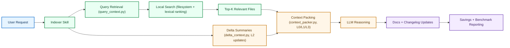
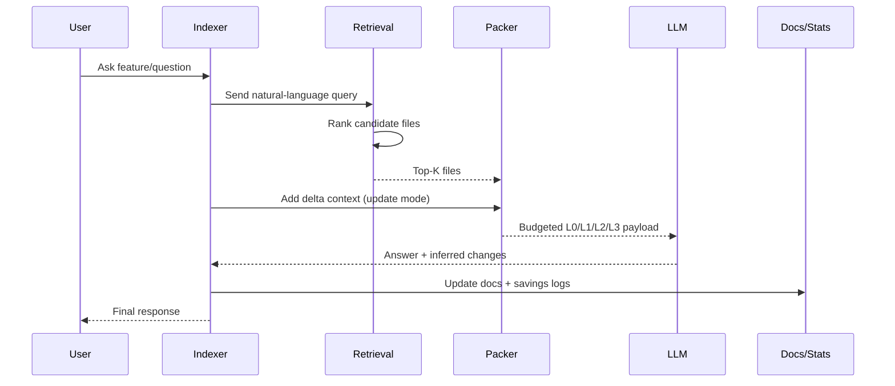

# codebase-indexer

A Claude Code skill that scans a project once and generates a living `.codebase-indexer/docs/` folder — so Claude reads the index instead of re-scanning the whole codebase every session.

This project borrows the shape of a few strong ideas, especially Composto's AST-first compression mindset and tree-sitter's structured approach to code understanding. The implementation here adapts those ideas natively inside Claude Code rather than depending on Composto or tree-sitter at runtime.

## What Is Different In This Fork

Compared to the parent repository, this fork adds a query-first retrieval layer and stronger indexing guidance for large/complex repos.

| Area | Upstream Style | This Fork |
|---|---|---|
| Retrieval flow | Glob/Grep-first scans | Prompt-driven retrieval (`scripts/query_context.py`) before packing |
| Context shaping | Docs-only compression | Tiered L0/L1/L2/L3 packing + delta summarization |
| Update scope | Changed files | Changed files + depth-1 dependents when graph is unavailable |
| Architecture indexing | General module map | Explicit execution entry map + multi-layer artifacts (`sql`, `prisma`, `openapi`, `docker-compose`) |
| Hidden dependency signals | Not emphasized | Git co-change coupling report (`scripts/coupling_report.py`) |
| Savings proof | Basic estimation | Project-local savings logs + measured A/B benchmark mode |

## Architecture Flow (Local-Only)



Plain-text fallback:

```text
User request -> query retrieval -> local search ranking -> top-K files ->
budgeted context packing (+ delta summaries in update mode) -> LLM ->
doc updates -> savings/benchmark reports
```

## Request Lifecycle (Color Diagram)



## Visual Demo GIFs

Drop GIF files into `assets/gifs/` with these names and they will render in the README.

### 1) Initial Index Run


### 2) Update Mode After Code Change


### 3) Query-Driven Retrieval + Packing


### 4) Savings + Benchmark Output


## Acknowledgments

- [heyEdem](https://github.com/heyEdem) — initial contributor; this project was started from a fork of their codebase-indexer repository.
- [Composto](https://github.com/mertcanaltin/composto) — inspiration for tiered signal extraction, context budgeting, and health/security-aware context design.
- [tree-sitter](https://tree-sitter.github.io/tree-sitter/) — parsing model and language-grammar ecosystem that informed the AST-first direction.
- [@joshtriedcoding on X](https://x.com/joshtriedcoding/status/2042535715712516284?s=20) — inspiration for the Virtual FS-style retrieval direction for agent workflows.
- [Upstash: First Look at Upstash Redis Search](https://upstash.com/blog/first-look-at-upstash-redis-search) — reference material behind the Virtual FS search/indexing idea.
- [DeusData/codebase-memory-mcp](https://github.com/DeusData/codebase-memory-mcp) — inspiration for impact-radius and structural query-first workflows.
- [giancarloerra/SocratiCode](https://github.com/giancarloerra/SocratiCode) — inspiration for multi-layer context coverage beyond source files.
- [harshkedia177/axon](https://github.com/harshkedia177/axon) — inspiration for entry-point orientation and git coupling signals.
- [JaredStewart/coderlm](https://github.com/JaredStewart/coderlm) — inspiration for symbol/query-driven exploration over raw file scanning.

## Evolution

- **Initial state:** a one-shot codebase indexer that produced a durable `.codebase-indexer/docs/` scaffold from a single scan.
- **Next:** auto-update rules were added so Claude could keep the index current without repeated manual runs.
- **Then:** changelog and decision tracking were layered in to preserve context across sessions.
- **Then:** graph-aware blast radius support was added to make update mode more targeted.
- **Now:** a signal-first, AST-inspired workflow (tiered extraction + budget-aware context packing) guides scans and updates while remaining self-contained.

## What it does

**First run:** Scans your project, writes five doc files, and installs auto-update rules in your project's `CLAUDE.md`:

| File | Purpose |
|---|---|
| `.codebase-indexer/docs/architecture.md` | Structure, module map, data flow, external dependencies |
| `.codebase-indexer/docs/implementation.md` | Per-module breakdown — entry points, key classes/functions |
| `.codebase-indexer/docs/patterns.md` | Naming conventions, folder conventions, recurring idioms |
| `.codebase-indexer/docs/decisions.md` | ADRs — *why* things are the way they are |
| `.codebase-indexer/docs/changelog.md` | Dated log of what changed and which modules were affected |

**After the first run, docs are maintained automatically by default.** The rules in `CLAUDE.md` make Claude read the index at session start and keep it updated as you ship features and bugfixes.

On first run, you'll be asked whether `.codebase-indexer/` should be committed (shared with the team) or gitignored (local only).

## Install

```bash
git clone https://github.com/Elvis020/codebase-indexer.git ~/.claude/skills/codebase-indexer
```

Claude Code will discover the skill automatically on next launch.

## Usage

Open any project in Claude Code and say:

- **"index this codebase"** — runs full initial scan

That's it. After the first scan, Claude handles everything automatically via the rules it plants in your project's `CLAUDE.md`.

You can still manually trigger updates anytime by saying **"update docs"** or **"re-index"**.

Savings visibility (current project):
- **"/codebase-indexer savings"** — terminal comparison report
- **"/codebase-indexer savings terminal"** — explicit terminal mode
- **"/codebase-indexer savings html"** — generates a timestamped report in `.codebase-indexer/reports/` (`codebase-indexer-savings-YYYYMMDD-HHMMSS.html`)
- After every successful `/codebase-indexer` run, savings are generated automatically by default:
  - terminal comparison shown immediately
  - new timestamped HTML report written to `.codebase-indexer/reports/` (e.g., `codebase-indexer-savings-YYYYMMDD-HHMMSS.html`)

Measured A/B benchmark commands (no script path needed):
- **"/codebase-indexer benchmark"** — measured A/B + terminal output
- **"/codebase-indexer benchmark terminal"** — measured A/B + terminal output
- **"/codebase-indexer benchmark html"** — measured A/B + timestamped HTML output
- **"/codebase-indexer benchmark both"** — measured A/B + terminal + HTML

## Supported project types

Detects and handles: Node.js, Java (Maven/Gradle), Go, Python, Rust, .NET, PHP — and polyglot/monorepo setups.

## How it works

```
First run (invoke once)              Every session after (automatic)
───────────────────────              ───────────────────────────────
Query + scan codebase (signal-first) → Claude reads .codebase-indexer/docs/ at session start
Generate 5 doc files           →     No re-scan needed
Install rules in CLAUDE.md     →     Auto-updates docs after changes
Add .codebase-indexer/ to .gitignore        →     Appends changelog entries
```

Architecture reference diagram:
- `guides/indexer-overview.md`
- `guides/indexer-overview-local.md` (current implementation, local-only)

Optional deterministic helpers (inside this repo):
- `scripts/context_packer.py` — budget-aware L0/L1/L3 context packing
- `scripts/delta_context.py` — L2-style diff summarization for update mode
- `scripts/query_context.py` — prompt-driven retrieval + budget-aware packing (auto file selection from user request)
- `scripts/coupling_report.py` — git co-change coupling report to surface hidden file dependencies

## Skill structure

```
~/.claude/skills/codebase-indexer/
  SKILL.md                  ← entry point
  guides/
    initial-scan.md         ← Phase 1: full scan steps
    update-mode.md          ← Phase 2: diff-based updates
    signal-first-ir.md      ← AST-inspired signal-first extraction rules
    gitignore-rules.md      ← .gitignore handling
  scripts/
    context_packer.py       ← deterministic context packing helper
    delta_context.py        ← deterministic delta summarization helper
    query_context.py        ← prompt-driven context retrieval helper
    coupling_report.py      ← git co-change coupling helper
  templates/
    architecture.md         ← template for each doc file
    implementation.md
    patterns.md
    decisions.md
    changelog.md
    claude-md-rules.md      ← rules planted into CLAUDE.md
```

Uses progressive disclosure — Claude only loads the files it needs for the current phase.
