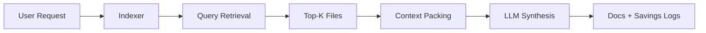

# <span style="color:#6366F1">⟁</span> codebase-indexer

> Give your AI a durable, low-token memory of your codebase.

[](https://www.python.org/)
[](LICENSE)
[](https://github.com/Elvis020/codebase-indexer/stargazers)
[](#quick-start)

`codebase-indexer` builds and maintains a compact documentation index so your AI agent reads curated project context instead of repeatedly scanning raw source files.

## 🧭 Quick Navigation

- [🚀 Quick Start](#quick-start)
- [📦 Generated Output](#generated-output)
- [⚙️ Operating Modes](#operating-modes)
- [🛠️ Helper Scripts](#helper-scripts)
- [🎨 How It Works](#how-it-works)
- [🧬 Evolution](guides/evolution.md)
- [❓ FAQ](guides/faq.md)

## 🔥 Why This Exists

Most AI coding sessions waste tokens rediscovering project structure.

- Medium project (50-200 files): often ~20k tokens of repeated context loading
- Large project (1,000+ files): often ~90k+ tokens of repeated context loading
- Same repository, same context, every new session

`codebase-indexer` shifts that cost to a one-time index + incremental updates.

## ✨ What You Get

- A generated docs index in `.codebase-indexer/docs/`
- Incremental update flow (changed files + nearby impact)
- Savings tracking (`savings.jsonl`) and optional HTML reports
- Optional benchmark mode for measured A/B token comparisons
- Helper scripts for retrieval, packing, diff summarization, and coupling analysis in [`scripts/`](scripts/)

## 💜 Acknowledgments

- [heyEdem](https://github.com/heyEdem) — original author; codebase-indexer started as a fork
- [Composto](https://github.com/ComposTo) — tiered signal extraction, context budgeting inspiration
- [tree-sitter](https://tree-sitter.github.io/tree-sitter/) — AST-first parsing model
- [@joshtriedcoding](https://github.com/joshtriedcoding) — Virtual FS-style retrieval inspiration
- [Upstash Redis Search](https://upstash.com/docs/redis/features/search) — search/indexing patterns
- [DeusData/codebase-memory-mcp](https://github.com/DeusData/codebase-memory-mcp) — impact-radius thinking
- [giancarloerra/SocraticCode](https://github.com/giancarloerra/SocraticCode) — multi-layer context coverage
- [harshkedia177/axon](https://github.com/harshkedia177/axon) — entry-point orientation, git coupling
- [JaredStewart/coderlm](https://github.com/JaredStewart/coderlm) — symbol-first exploration

## 📚 More

- [🧬 Evolution](guides/evolution.md)
- [❓ FAQ](guides/faq.md)
- [📘 Indexer Overview](guides/indexer-overview.md)
- [🧠 Signal-First IR](guides/signal-first-ir.md)
- [🔄 Update Mode](guides/update-mode.md)

<a id="quick-start"></a>
## 🚀 Quick Start

```bash
# Clone into Claude skills path
git clone https://github.com/Elvis020/codebase-indexer.git ~/.claude/skills/codebase-indexer

# Or clone anywhere and reference SKILL.md from your AI tooling
git clone https://github.com/Elvis020/codebase-indexer.git /path/to/codebase-indexer
```

Then in your agent:

```text
index this codebase
```

<a id="generated-output"></a>
## 📦 Generated Output

The indexer writes five core docs into `.codebase-indexer/docs/`:

- [`architecture.md`](templates/architecture.md): module boundaries, data flow, dependencies, entry points
- [`implementation.md`](templates/implementation.md): implementation-level breakdown (classes/functions/tests)
- [`patterns.md`](templates/patterns.md): conventions, recurring idioms, folder and naming patterns
- [`decisions.md`](templates/decisions.md): architecture decisions and rationale
- [`changelog.md`](templates/changelog.md): dated updates with module-level context

On first run, you choose whether `.codebase-indexer/` is committed (team-shared) or gitignored (local-only).

<a id="operating-modes"></a>
## ⚙️ Operating Modes

### 1) Initial Scan
Full index generation for first-time setup.

### 2) Supplement Mode
If existing docs already cover structure, generates only missing docs to avoid redundant work.

### 3) Update Mode
Refreshes changed areas after feature work, instead of rebuilding the entire index.

### 4) Savings + Benchmark
- `/codebase-indexer savings`
- `/codebase-indexer savings html`
- `/codebase-indexer benchmark`
- `/codebase-indexer benchmark html`
- `/codebase-indexer benchmark both`

<a id="helper-scripts"></a>
## 🛠️ Helper Scripts

Located in `scripts/`:

- [`context_packer.py`](scripts/context_packer.py)
- [`delta_context.py`](scripts/delta_context.py)
- [`query_context.py`](scripts/query_context.py)
- [`coupling_report.py`](scripts/coupling_report.py)
- [`savings_report.py`](scripts/savings_report.py)
- [`savings_benchmark.py`](scripts/savings_benchmark.py)

Examples:

```bash
# Coupling signals
python3 ~/.claude/skills/codebase-indexer/scripts/coupling_report.py --project-root .

# Savings report (terminal + html)
python3 ~/.claude/skills/codebase-indexer/scripts/savings_report.py \
  --project-root . --format both --output .codebase-indexer/reports/savings.html
```

<a id="how-it-works"></a>
## 🎨 How It Works (High Level)



For deeper internals, see:

- [Indexer Overview](guides/indexer-overview.md)
- [Signal-First IR](guides/signal-first-ir.md)
- [Initial Scan](guides/initial-scan.md)
- [Update Mode](guides/update-mode.md)
- [Stats Logging](guides/stats-logging.md)
- [Stats Report](guides/stats-report.md)
- [Graph Integration](guides/graph-integration.md)
- [Evolution](guides/evolution.md)
- [FAQ](guides/faq.md)

## 🗂️ Repository Structure

```text
.
├── guides/
├── scripts/
├── templates/
├── stats/
├── assets/
├── SKILL.md
└── README.md
```

## 📄 License

MIT. See [LICENSE](LICENSE).
