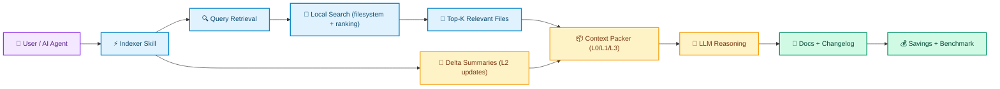
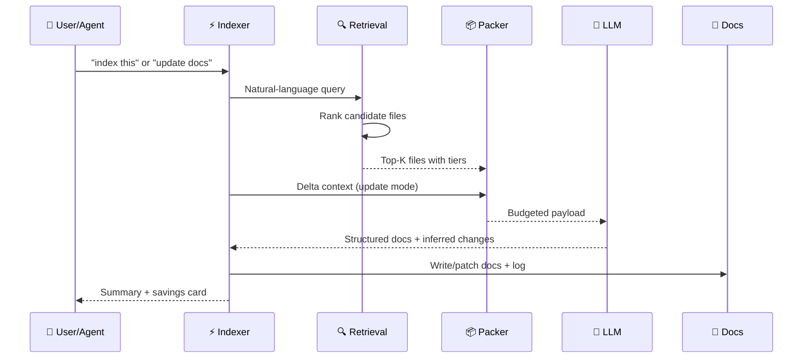

# <span style="color:#6366F1">⟁</span> codebase-indexer

<h3 style="color:#6366F1; font-weight: 400; margin-top: 0;">Give your AI a photographic memory for your codebase</h3>

<p align="center">
  <a href="https://github.com/Elvis020/codebase-indexer/stargazers">
    
  </a>
  <a href="https://img.shields.io/badge/Python-3.9+-3776AB?logo=python&logoColor=white">
    
  </a>
  <a href="LICENSE">
    
  </a>
  
</p>

---

## <span style="color:#F59E0B">🔥</span> The Problem Nobody Talks About

Every time your AI opens a codebase, it plays a game of "Reader's Digest" — scanning **thousands of lines of code** just to understand what your project does.

For a **medium project** (200 files): ~30,000 tokens burned before you've typed a single question.
For a **large project** (1,000+ files): ~160,000 tokens. That's roughly **80 pages of text**.

**And it happens. Every. Single. Session.**

It's like hiring a new developer who needs to re-read your entire codebase every morning. At some point, you'd just... stop hiring.

---

## <span style="color:#10B981">✨</span> The Solution: A Living Index

Run `/codebase-indexer` once. It builds a lean, mean documentation machine — five markdown files that capture your entire codebase's soul.

From then on? Your AI reads the index (~800–4,000 tokens) instead of your raw source (8,000–160,000 tokens). Docs stay fresh automatically — they update after each commit like self-cleaning windows.

> 🧠 **Think of it as giving your AI a photographic memory.** Once indexed, never forget.

### 💰 Savings At A Glance

| Project Size | Files | Tokens Saved/Session | At $3/M tokens |
|:---:|:---:|:---:|:---:|
| 🐣 Small | < 50 | ~8,000 | ~$0.024 |
| 🐥 Medium | 50–200 | ~20,000 | ~$0.060 |
| 🐓 Large | 200–1,000 | ~45,000 | ~$0.135 |
| 🦅 XL | 1,000+ | ~90,000 | ~$0.270 |

---

## <span style="color:#8B5CF6">🚀</span> Quick Start

```bash
# Install (once, globally — works with ANY AI agent)
git clone https://github.com/Elvis020/codebase-indexer.git ~/.claude/skills/codebase-indexer

# Or for other AI agents, just clone and reference the SKILL.md
git clone https://github.com/Elvis020/codebase-indexer.git /path/to/your-preferred-location
```

Then, in **any AI agent** (Claude, Cursor, Copilot, custom agents — you name it), say:

```
index this codebase
```

That's it. The indexer scans, writes five docs, plants auto-update rules, and logs your savings baseline. Every future session starts from the index.

> **Works with:** Claude Code, Cursor, GitHub Copilot, Devin, any custom AI agent, or even your own LLM setup. If it can run Python and read files, it can use this.

---

## <span style="color:#06B6D4">📦</span> What It Generates

Five markdown files in `.codebase-indexer/docs/`:

| File | What's Inside | Color |
|:---|:---|:---|
| `architecture.md` | Module structure, data flow, entry points, deps, multi-layer artifacts | 🏗️ |
| `implementation.md` | Per-module breakdown — classes, functions, test coverage | 🧩 |
| `patterns.md` | Naming conventions, folder rules, recurring idioms | 🪢 |
| `decisions.md` | ADRs — why you made choices (git-inferred + stated) | 🧠 |
| `changelog.md` | Dated log of changes with module tags | 📋 |

Auto-update rules are planted into your project's `CLAUDE.md` (or equivalent) so your AI reads the index at session start and updates only touched sections after commits — no manual re-runs needed.

On first run, you'll be asked whether `.codebase-indexer/` should be **committed** (team-shared) or **gitignored** (local only). Either way, the index is fully regeneratable from source.

---

## <span style="color:#F97316">⚙️</span> Modes

### 🔍 Phase 1 — Initial Scan

Full first-time indexing. Uses **signal-first, tiered extraction** across your source tree:

```
1. Query retrieval     →  Natural language narrows the relevant file set
2. Four-tier extraction  →  L0 exports → L1 signatures → L2 signals → L3 noise dropped
3. Budget-aware packing →  Token budget allocated across tiers
4. Docs written         →  Five index files + auto-update rules
```

### 📝 Supplement Mode

If a comprehensive `CLAUDE.md` already exists but no structured index does, the indexer generates **only the three gap docs** (`patterns.md`, `decisions.md`, `changelog.md`) — skipping what's already documented. Saves tokens even at indexing time.

### 🔄 Phase 2 — Update Mode

Triggered by saying *"update docs"*, *"re-index"*, or finishing a feature/bugfix. Refreshes **only changed files + their depth-1 dependents** — not the whole project.

- Without graph: import-scan finds direct callers
- With `code-review-graph`: `get_impact_radius_tool` traces exact blast radius

**Saves 12,000–17,000 tokens immediately** per update run.

### 📊 Savings Report

```bash
/codebase-indexer savings            # Terminal comparison (last run vs cumulative)
/codebase-indexer savings html       # Timestamped HTML report with visual A/B bar
```

HTML reports land in `.codebase-indexer/reports/codebase-indexer-savings-YYYYMMDD-HHMMSS.html`

### 🎯 Benchmark Mode

```bash
/codebase-indexer benchmark          # Exact byte-counted A/B + terminal output
/codebase-indexer benchmark html     # Full HTMLreport with charts
/codebase-indexer benchmark both      # Terminal + HTML
```

Produces `benchmark_measured` entries with exact token counts — not heuristics. Use this in demos when you need hard evidence.

---

## <span style="color:#EC4899">🎨</span> How It Works

### The Core Idea

```
First run (once)                              Every session after (automatic)
────────────────────────────                   ──────────────────────────────────────
Signal-first scan + IR extraction         →    AI reads .codebase-indexer/docs/
Budget-aware context packing               →    800–4,000 tokens instead of 8K–160K
Write 5 index docs                         →    No rescan needed
Plant rules in CLAUDE.md                    →    Docs auto-update after each commit
Ask: commit or gitignore?                   →    Changelog entries appended on change
```

### Architecture Flow



### Request Lifecycle



---

## <span style="color:#6366F1">🔬</span> Signal-First Extraction

All scans use a **four-tier extraction model** — highest signal first, noise dropped:

| Tier | Content | Treatment |
|:---:|:---|:---|
| **L0** | Public exports, API surface, module boundaries | Always keep — full fidelity |
| **L1** | Function signatures, types, doc comments | Keep compressed |
| **L2** | Implementation with signal words (`TODO`, `throws`, security patterns) | Summarize by diff hunk |
| **L3** | Tests, build files, auto-generated code | Drop or reference-only |

Context budget is allocated across tiers: changed/hotspot files get detailed treatment; unchanged neighbors get structure-only.

> ⚠️ **Health & security signals flagged during L2:** `API_KEY =`, `SECRET =`, `password =`, `token =`, `console.log(`, `debugger;`, `pdb.set_trace()`, `TODO: remove`, `FIXME`

---

## <span style="color:#14B8A6">🛠️</span> Helper Scripts

| Script | What It Does |
|:---|:---|
| `context_packer.py` | Budget-aware L0/L1/L3 context packing within token budget |
| `delta_context.py` | L2-style diff summarization from unified diff (stdin or --repo + --files) |
| `query_context.py` | Prompt-driven retrieval — auto-selects relevant files from query |
| `coupling_report.py` | Git co-change analysis — surfaces files that move together |
| `savings_report.py` | Terminal + HTML savings reporting from `.codebase-indexer/savings.jsonl` |
| `savings_benchmark.py` | Measured A/B benchmark — counts actual byte sizes |

```bash
# Get coupling signals
python3 ~/.claude/skills/codebase-indexer/scripts/coupling_report.py --project-root .

# Generate savings HTML report
python3 ~/.claude/skills/codebase-indexer/scripts/savings_report.py \
  --project-root . --format both --output .codebase-indexer/reports/savings.html
```

---

## <span style="color:#F59E0B">📈</span> Savings Visibility

Every run appends to:

```
~/.claude/skills/codebase-indexer/stats/runs.jsonl          ← global (all projects)
<project-root>/.codebase-indexer/savings.jsonl             ← project-local
```

The HTML report includes:

- **Efficiency headline** — average % context reduction
- **Token-to-pages** — "≈ 23 pages of source code not loaded"
- **Visual A/B stacked bar** — indexer cost vs saved vs future savings
- **ROI payback** — estimated sessions until indexing investment is recouped
- **Mode contribution chart** — full/update/supplement value breakdown
- **Docs inventory** — every `.md` file with size + last-modified
- **Full run history** — color-coded by mode, expandable

---

## <span style="color:#8B5CF6">🌐</span> Multi-Repo Support

If a `workspace.md` registry exists in the **parent directory**, the indexer enables cross-repo context lookups:

```
parent-dir/
  workspace.md              ← agent-agnostic registry of all repos + docs paths
  repo-a/
    .codebase-indexer/
  repo-b/
    .codebase-indexer/
```

Format is plain markdown — readable by **any AI agent**, not just Claude.

---

## <span style="color:#06B6D4">🏆</span> How We Compare

| Tool | Approach | Infrastructure | Token Strategy |
|:---|:---|:---|:---|
| **codebase-indexer** | Docs-first — pre-built markdown, auto-maintained | **Agent skill only** | Read once at start (800–4K tokens) |
| codebase-memory-mcp | Graph query — SQLite + Cypher | MCP server + tree-sitter | Query on demand |
| SocratiCode | Vector search — Qdrant HNSW + BM25 | Docker + Qdrant + Ollama | Semantic chunks |
| Axon | Knowledge graph — KuzuDB + clustering | Python + KuzuDB | Structural queries |
| coderlm | Symbol table — Rust server | Separate Rust process | Symbol lookups |

**Choose codebase-indexer when you want:**
- Zero infrastructure — no Docker, no database, no server
- Human-readable index — teammates open `architecture.md` in any editor
- Automatic maintenance — docs update as you ship
- Works with **any AI agent** — not locked to one platform

**Choose graph/vector tools when you need:**
- Ad-hoc structural queries at runtime
- >500K LOC with sub-second traversal
- Live file watching on every save

---

## <span style="color:#10B981">🎓</span> Supported Project Types

**Languages:** TypeScript · JavaScript · Python · Go · Rust · Java · Kotlin · C# · PHP · Ruby · Swift

**Build systems:** npm/pnpm/yarn · Maven · Gradle · Cargo · Go modules · pip/Poetry · Composer

**Multi-layer artifacts:**
- DB schemas: `.sql`, `prisma.schema`, `schema.rb`
- API specs: OpenAPI `.yaml` / `.json`
- Infrastructure: `docker-compose.yml`, `Dockerfile`, Terraform `.tf`

**Repo layouts:** monorepo · polyglot · multi-module — all handled via `workspace.md` registry.

---

## <span style="color:#F97316">📂</span> Skill Structure

```
~/.claude/skills/codebase-indexer/
├── SKILL.md                        ← entry point: mode detection + execution
├── guides/
│   ├── initial-scan.md             ← Phase 1: full scan steps
│   ├── update-mode.md              ← Phase 2: diff-based refresh
│   ├── signal-first-ir.md          ← 4-tier extraction + budget spec
│   ├── graph-integration.md        ← code-review-graph MCP (optional)
│   └── multi-repo.md               ← cross-repo workspace registry
├── templates/
│   ├── architecture.md             ← output template
│   ├── implementation.md           ← output template
│   ├── patterns.md                 ← output template
│   ├── decisions.md                ← output template
│   ├── changelog.md                ← output template
│   └── claude-md-rules.md          ←auto-planted update rules
├── scripts/
│   ├── context_packer.py           ← L0/L1/L3 budget packing
│   ├── delta_context.py            ← L2 diff summarization
│   ├── query_context.py            ← prompt-driven retrieval
│   ├── coupling_report.py          ← git co-change analysis
│   ├── savings_report.py           ← terminal + HTML reporting
│   └── savings_benchmark.py        ← measured A/B benchmark
└── stats/
    └── runs.jsonl                  ← append-only global run log
```

Uses **progressive disclosure** — only relevant guides load per phase.

---

## <span style="color:#6366F1">❓</span> FAQ

<details>
<summary><strong>Does the index get stale?</strong></summary>

Rules in your project's `CLAUDE.md` tell your AI to check and update relevant docs after every change. Most projects stay accurate without manual intervention. For a full refresh: say "re-index".

</details>

<details>
<summary><strong>Should I commit .codebase-indexer/?</strong></summary>

Your call. **Commit it** if you want the team to benefit on clone. **Gitignore it** if you prefer local-only. Index is fully regeneratable from source anytime.

</details>

<details>
<summary><strong>My project already has a detailed CLAUDE.md. Does it still help?</strong></summary>

Yes — **Supplement Mode** detects existing context and generates only `patterns.md`, `decisions.md`, and `changelog.md`. No redundant work.

</details>

<details>
<summary><strong>How accurate are the token savings estimates?</strong></summary>

Estimates use file-count buckets (labeled "estimated"). For exact counts, run `/codebase-indexer benchmark` — it reads actual byte sizes and logs "measured" entries.

</details>

<details>
<summary><strong>Can I use this with other AI agents besides Claude?</strong></summary>

**Absolutely.** The skill works with any AI agent that can execute Python and read files. Clone it anywhere, reference `SKILL.md`, and enjoy the same benefits.

</details>

---

## <span style="color:#EC4899">🧬</span> Evolution

| Version | What Was Added |
|:---:|:---|
| v1 | One-shot scanner → five docs + CLAUDE.md rules |
| v2 | Auto-update mode — diff-based refresh |
| v3 | Changelog and ADR tracking |
| v4 | Graph-aware blast radius |
| v5 | Signal-first IR — four-tier extraction |
| v6 | Token savings visibility |
| v7 | HTML savings report |
| v8 | Multi-repo workspace registry |
| v9 | Test coverage docs |
| v10 | AI-inferred "why" from git logs |

---

## <span style="color:#10B981">🤝</span> Contributing

Issues and PRs welcome! Before opening a PR:

1. Check that your change has a clear **token-efficiency rationale** — the primary value is reducing tokens per session, not adding features for their own sake.
2. Follow **progressive disclosure** — new guides should only load when needed for the current phase.
3. Run syntax check: `python3 -c "import ast; ast.parse(open('scripts/your_script.py').read())"`

---

## <span style="color:#F59E0B">💜</span> Acknowledgments

- [heyEdem](https://github.com/heyEdem) — original author; codebase-indexer started as a fork
- [Composto](https://github.com/mertcanaltin/composto) — tiered signal extraction, context budgeting inspiration
- [tree-sitter](https://tree-sitter.github.io/tree-sitter/) — AST-first parsing model
- [@joshtriedcoding](https://x.com/joshtriedcoding/status/2042535715712516284) — Virtual FS-style retrieval inspiration
- [Upstash Redis Search](https://upstash.com/blog/first-look-at-upstash-redis-search) — search/indexing patterns
- [DeusData/codebase-memory-mcp](https://github.com/DeusData/codebase-memory-mcp) — impact-radius thinking
- [giancarloerra/SocratiCode](https://github.com/giancarloerra/SocratiCode) — multi-layer context coverage
- [harshkedia177/axon](https://github.com/harshkedia177/axon) — entry-point orientation, git coupling
- [JaredStewart/coderlm](https://github.com/JaredStewart/coderlm) — symbol-first exploration

---

<p align="center">

**MIT** © [Elvis020](https://github.com/Elvis020)

Made with 💜 for developers who don't want their AI to read the same file twice

</p>