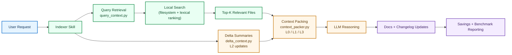
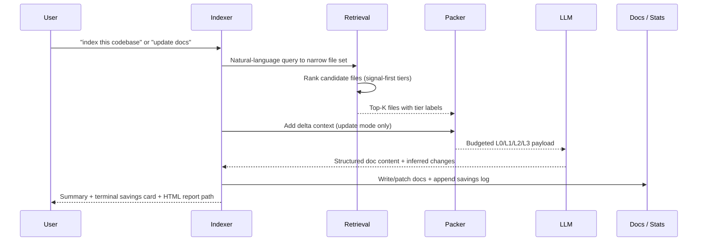

<div align="center">

# codebase-indexer

**A Claude Code skill that scans your project once and builds a living index — so Claude reads summaries instead of re-scanning source files every session.**

[](https://claude.ai/code)
[](https://www.python.org/)
[](LICENSE)
[](https://github.com/Elvis020/codebase-indexer/commits/main)

</div>

---

## The Problem

Every time you open a codebase with Claude, it re-reads dozens of files to orient itself. For a medium project (200 files) that is ~30,000 tokens of context burned before you have typed a single question. For a large project (1,000+ files) it is closer to 160,000 tokens.

**And it happens every single session.**

## The Solution

Run `/codebase-indexer` once. It generates five lean index files in `.codebase-indexer/docs/`. From then on, Claude reads the index (~800–4,000 tokens) instead of raw source (8,000–160,000 tokens). Docs stay current automatically — Claude updates only the changed sections after each commit.

**Estimated savings per future session** (heuristic, by project size):

| Project size | Files | Tokens saved / session | At $3/M tokens |
|---|---|---|---|
| Small | < 50 | ~8,000 | ~$0.024 |
| Medium | 50–200 | ~20,000 | ~$0.060 |
| Large | 200–1,000 | ~45,000 | ~$0.135 |
| XL | 1,000+ | ~90,000 | ~$0.270 |

> Savings figures are heuristic estimates based on project-file-count buckets. Run `/codebase-indexer benchmark` to get exact byte-counted measurements for your project.

---

## Quick Start

```bash
# Install (once, globally)
git clone https://github.com/Elvis020/codebase-indexer.git ~/.claude/skills/codebase-indexer
```

Then open **any project** in Claude Code and say:

```
index this codebase
```

That is it. The indexer scans, writes five docs, installs auto-update rules into your project's `CLAUDE.md`, and logs a savings baseline. Every future session starts from the index.

---

## What It Generates

Five markdown files written to `.codebase-indexer/docs/`:

| File | What it captures |
|---|---|
| `architecture.md` | Module structure, data flow, execution entry points, external dependencies, multi-layer artifacts (SQL, Prisma, OpenAPI, docker-compose) |
| `implementation.md` | Per-module breakdown — key classes, functions, test coverage map |
| `patterns.md` | Naming conventions, folder conventions, recurring idioms, git coupling signals |
| `decisions.md` | ADRs — stated reason (`Why:`) plus git-inferred evidence (`Why (inferred):`) from commit history |
| `changelog.md` | Dated log of changes with affected module tags |

Auto-update rules are planted into your project's `CLAUDE.md` so Claude reads the index at session start and updates only the touched sections after each commit — no manual re-runs.

On first run, you will be asked whether `.codebase-indexer/` should be **committed** (shared with the team) or **gitignored** (local only). Both work — the index is fully regeneratable from source.

---

## Modes

### Phase 1 — Initial Scan

Full first-time indexing. Uses **signal-first, tiered extraction** across your source tree:

1. Query retrieval narrows the relevant file set from a natural-language description of your project.
2. A four-tier extraction model (L0 exports → L1 signatures → L2 implementation signals → L3 dropped noise) compresses source into structured IR.
3. Budget-aware context packing allocates token budget across tiers before writing docs.
4. Five doc files are written; rules are installed in `CLAUDE.md`.

### Supplement Mode

If a comprehensive `CLAUDE.md` already exists but no structured index does, the indexer generates **only the three gap docs** (`patterns.md`, `decisions.md`, `changelog.md`) — skipping what is already documented. Saves tokens at indexing time too.

### Phase 2 — Update Mode

Triggered automatically when you say *"update docs"*, *"re-index"*, or finish a feature or bugfix. Refreshes **only the changed files and their depth-1 dependents** — not the whole project.

- Without graph: import-scan finds direct callers/dependents.
- With `code-review-graph`: `get_impact_radius_tool` traces exact blast radius.

Saves **12,000–17,000 tokens immediately** per update run.

### Savings Report

```bash
/codebase-indexer savings            # terminal comparison (last run vs cumulative)
/codebase-indexer savings html       # timestamped HTML report with visual A/B bar
```

After every successful run, **both are generated automatically** — no extra command needed. HTML reports land in `.codebase-indexer/reports/codebase-indexer-savings-YYYYMMDD-HHMMSS.html`.

### Benchmark Mode

```bash
/codebase-indexer benchmark          # exact byte-counted A/B + terminal output
/codebase-indexer benchmark html     # full HTML report with all charts
/codebase-indexer benchmark both     # terminal + HTML
```

Produces a `benchmark_measured` entry with exact token counts from actual file sizes — not heuristics. Use this in demos when you need hard evidence.

---

## How It Works

### The core idea

```
First run (once)                         Every session after (automatic)
────────────────────────────             ──────────────────────────────────────
Signal-first scan + IR extraction   →    Claude reads .codebase-indexer/docs/ at start
Budget-aware context packing        →    800–4,000 tokens instead of 8K–160K
Write 5 index docs                  →    No rescan needed
Plant rules in CLAUDE.md            →    Docs auto-update after each commit
Ask: commit or gitignore index?     →    Changelog entries appended on change
```

### Architecture flow



### Request lifecycle



---

## Signal-First Extraction

All scans apply a **four-tier extraction model** — highest signal first, noise dropped or compressed:

| Tier | Content | Treatment |
|---|---|---|
| **L0** | Public exports, API surface, module boundaries | Always keep — full fidelity |
| **L1** | Function signatures, type annotations, doc comments | Keep compressed |
| **L2** | Implementation bodies with signal words (`TODO`, `throws`, security patterns, `console.log`) | Summarize by diff hunk |
| **L3** | Tests, build files, auto-generated code | Drop or reference-only |

Context budget is then allocated across tiers: changed/hotspot files get detailed treatment; unchanged neighbors get structure-only. This is coordinated by `scripts/context_packer.py`.

**Health and security signals** flagged during L2 extraction: `API_KEY =`, `SECRET =`, `password =`, `token =`, `console.log(`, `debugger;`, `pdb.set_trace()`, `TODO: remove`, `FIXME`.

---

## Helper Scripts

All scripts are **deterministic helpers** — suggest them to the user, do not run autonomously.

| Script | What it does |
|---|---|
| `context_packer.py` | Budget-aware L0/L1/L3 context packing — takes a list of files, returns a prioritized context payload within a token budget |
| `delta_context.py` | L2-style diff summarization — reads a unified diff (stdin or `--repo + --files`) and outputs structured hunk summaries |
| `query_context.py` | Prompt-driven retrieval — auto-selects relevant files from a natural-language query, then packs them into budget |
| `coupling_report.py` | Git co-change analysis — mines commit history to surface files that move together >50% of the time |
| `savings_report.py` | Generates terminal comparison or HTML savings report from the project-local `.codebase-indexer/savings.jsonl` log |
| `savings_benchmark.py` | Measured A/B benchmark — counts actual byte sizes of source vs index files, logs a `benchmark_measured` entry |

```bash
# Example: get coupling signals for a project
python3 ~/.claude/skills/codebase-indexer/scripts/coupling_report.py --project-root .

# Example: generate savings HTML report
python3 ~/.claude/skills/codebase-indexer/scripts/savings_report.py \
  --project-root . --format both \
  --output .codebase-indexer/reports/savings.html --timestamp-html yes
```

---

## Savings Visibility

Every run appends to two logs:

```
~/.claude/skills/codebase-indexer/stats/runs.jsonl   ← global (all projects)
<project-root>/.codebase-indexer/savings.jsonl        ← project-local
```

The HTML report (`/codebase-indexer savings html`) includes:

- **Efficiency headline** — average % context reduction across all runs
- **Token-to-pages translation** — "≈ 23 pages of source code not loaded"
- **Visual A/B stacked bar** — indexer cost vs saved-now vs future savings against baseline
- **ROI payback** — estimated update sessions until indexing investment is recouped
- **Mode contribution chart** — which modes (full / update / supplement) are generating the most value
- **Docs inventory** — every `.codebase-indexer/docs/*.md` file with size and last-modified date
- **Full run history** — all logged runs, color-coded by mode, with expand/collapse

---

## Multi-Repo Support

If a `workspace.md` registry exists in the **parent directory** of your project, the indexer detects it and enables cross-repo context lookups.

```
parent-dir/
  workspace.md          ← agent-agnostic registry of all repos + their docs paths
  repo-a/
    .codebase-indexer/
  repo-b/
    .codebase-indexer/
```

Format is plain markdown — readable by any AI agent, not just Claude. See `templates/workspace.md` for the spec.

---

## How We Compare

There are several strong codebase indexing tools. Here is how the architectural approaches differ:

| Tool | Approach | Infrastructure needed | Token strategy |
|---|---|---|---|
| **codebase-indexer** | **Docs-first** — pre-built markdown summaries, auto-maintained | Claude Code skill only | Read once at session start (800–4K tokens) |
| [codebase-memory-mcp](https://github.com/DeusData/codebase-memory-mcp) | Graph query — SQLite + Cypher + Aho-Corasick multi-pattern search | MCP server + tree-sitter | Query on demand (~3.4K per query vs ~412K grep) |
| [SocratiCode](https://github.com/giancarloerra/SocratiCode) | Vector search — Qdrant HNSW + BM25 hybrid + RRF | Docker + Qdrant + Ollama | Semantic chunks on demand |
| [Axon](https://github.com/harshkedia177/axon) | Knowledge graph — KuzuDB + Leiden clustering + execution flow tracing | Python + KuzuDB | Structural queries + BFS impact radius |
| [coderlm](https://github.com/JaredStewart/coderlm) | Symbol table — Rust server + tree-sitter cross-references | Separate Rust server process | Precise symbol lookups |

**When to choose codebase-indexer:**
- You want **zero infrastructure** — no Docker, no database, no server process.
- You want the index to be **human-readable** — your teammates can open `architecture.md` in any editor.
- You want **automatic maintenance** — docs update themselves as you ship, not on explicit re-index commands.
- Your workflow is **session-based** — Claude Code is your primary interface.

**When to choose a graph/vector tool instead:**
- You need **ad-hoc structural queries** at runtime ("what are all callers of `processOrder`?").
- Your codebase is >500K LOC and you need sub-second traversal.
- You want **live file watching** and index updates triggered automatically on save.

---

## Supported Project Types

Auto-detects and handles:

**Languages:** TypeScript · JavaScript · Python · Go · Rust · Java · Kotlin · C# (.NET) · PHP · Ruby · Swift

**Build systems:** npm/pnpm/yarn · Maven · Gradle · Cargo · Go modules · pip/Poetry · Composer

**Multi-layer artifacts** (indexed alongside source when present):
- Database schemas: `.sql`, `prisma.schema`, `schema.rb`
- API specs: OpenAPI `.yaml` / `.json`
- Infrastructure: `docker-compose.yml`, `Dockerfile`, Terraform `.tf`

**Repo layouts:** monorepo · polyglot · multi-module — all handled. Cross-repo context available via `workspace.md` registry.

---

## Skill Structure

```
~/.claude/skills/codebase-indexer/
  SKILL.md                          ← entry point: mode detection + execution table
  guides/
    initial-scan.md                 ← Phase 1: full scan steps (signal-first)
    update-mode.md                  ← Phase 2: diff-based update steps
    signal-first-ir.md              ← 4-tier extraction + budget-aware packing spec
    gitignore-rules.md              ← .gitignore handling
    graph-integration.md            ← code-review-graph MCP integration (optional)
    multi-repo.md                   ← cross-repo workspace registry
    stats-logging.md                ← savings logging spec (JSONL format)
    stats-report.md                 ← savings report generation guide
  templates/
    architecture.md                 ← output template
    implementation.md               ← output template
    patterns.md                     ← output template
    decisions.md                    ← output template (with Why vs Why (inferred))
    changelog.md                    ← output template
    claude-md-rules.md              ← rules auto-planted into project CLAUDE.md
    workspace.md                    ← workspace registry template
  scripts/
    context_packer.py               ← L0/L1/L3 budget-aware packing
    delta_context.py                ← L2-style diff summarization
    query_context.py                ← prompt-driven retrieval
    coupling_report.py              ← git co-change coupling analysis
    savings_report.py               ← terminal + HTML savings reporting
    savings_benchmark.py            ← measured A/B benchmark
  stats/
    runs.jsonl                      ← append-only global run log (auto-created)
```

Uses **progressive disclosure** — Claude loads only the guides relevant to the current phase, not the full skill on every invocation.

---

## Frequently Asked Questions

<details>
<summary><strong>Does the index get stale?</strong></summary>

The rules installed in your project's `CLAUDE.md` tell Claude to check and update relevant docs after every feature or bugfix. For most projects this keeps the index accurate without manual intervention. If you want a full refresh, say `"re-index"` in Claude Code.

</details>

<details>
<summary><strong>Should I commit .codebase-indexer/?</strong></summary>

Your choice, made on first run. **Commit it** if you want your team to benefit from the index immediately on clone. **Gitignore it** if you prefer local-only usage. The index is fully regeneratable from source at any time.

</details>

<details>
<summary><strong>My project already has a detailed CLAUDE.md. Does it still help?</strong></summary>

Yes — **Supplement Mode** kicks in. The indexer detects that `architecture.md` and `implementation.md` context already exists and generates only the three docs that CLAUDE.md typically skips: `patterns.md`, `decisions.md`, and `changelog.md`. No redundant work.

</details>

<details>
<summary><strong>How accurate are the token savings estimates?</strong></summary>

Savings estimates use file-count buckets (small/medium/large/XL) and are labeled `"estimated"` in the log. For exact measurements, run `/codebase-indexer benchmark` — it reads actual byte sizes of source files vs index files and logs a `"measured"` entry. The HTML report always shows which entries are measured vs estimated.

</details>

<details>
<summary><strong>Can I use this with a code review graph / LSP?</strong></summary>

Yes. If `.code-review-graph/graph.db` exists in the project root, the indexer uses `get_impact_radius_tool` in update mode to trace exact blast radius from changed symbols — more precise than import scanning alone. See `guides/graph-integration.md`.

</details>

<details>
<summary><strong>What is "supplement mode" vs "update mode"?</strong></summary>

- **Supplement mode** — runs once, when no index exists but a comprehensive CLAUDE.md does. Adds the missing docs.
- **Update mode** — runs repeatedly, after commits. Keeps existing docs current as code changes.

They are different phases solving different problems.

</details>

---

## Evolution

| Phase | What was added |
|---|---|
| v1 | One-shot scanner → five docs + CLAUDE.md rules |
| v2 | Auto-update mode — diff-based refresh of only changed sections |
| v3 | Changelog and ADR tracking — persistent decision memory across sessions |
| v4 | Graph-aware blast radius — update mode scopes to impact radius, not just changed files |
| v5 | Signal-first IR — four-tier extraction + budget-aware L0/L1/L2/L3 packing |
| v6 | Token savings visibility — project-local JSONL log + measured A/B benchmark |
| v7 | HTML savings report — visual A/B bar, efficiency %, ROI payback, docs inventory |
| v8 | Multi-repo workspace registry — cross-repo context via agent-agnostic `workspace.md` |
| v9 | Test coverage docs — 5-tier matching, per-module coverage map in `implementation.md` |
| v10 | AI-inferred "why" — git log evidence fills `Why (inferred):` in `decisions.md` |

---

## Contributing

Issues and pull requests are welcome. Before opening a PR:

1. Check that your change has a clear token-efficiency rationale — the primary value prop is reducing tokens per session, not adding features for their own sake.
2. If you are adding a new guide or template, follow the progressive-disclosure pattern: Claude should only load your file when it is needed for the current phase.
3. Run the syntax check on any modified scripts: `python3 -c "import ast; ast.parse(open('scripts/your_script.py').read())"`.

---

## Acknowledgments

- [heyEdem](https://github.com/heyEdem) — original author; this project started as a fork of their codebase-indexer.
- [Composto](https://github.com/mertcanaltin/composto) — inspiration for tiered signal extraction, context budgeting, and health/security-aware design.
- [tree-sitter](https://tree-sitter.github.io/tree-sitter/) — AST-first parsing model and language grammar ecosystem that informed the extraction tier design.
- [@joshtriedcoding](https://x.com/joshtriedcoding/status/2042535715712516284?s=20) — inspiration for the Virtual FS-style retrieval approach for agent workflows.
- [Upstash Redis Search](https://upstash.com/blog/first-look-at-upstash-redis-search) — reference for search/indexing patterns behind the retrieval layer.
- [DeusData/codebase-memory-mcp](https://github.com/DeusData/codebase-memory-mcp) — inspiration for impact-radius thinking and structural query-first workflows.
- [giancarloerra/SocratiCode](https://github.com/giancarloerra/SocratiCode) — inspiration for multi-layer context coverage and resumable indexing patterns.
- [harshkedia177/axon](https://github.com/harshkedia177/axon) — inspiration for entry-point orientation and git co-change coupling signals.
- [JaredStewart/coderlm](https://github.com/JaredStewart/coderlm) — inspiration for symbol-first exploration over raw file scanning.

---

## License

MIT © [Elvis0110](https://github.com/Elvis0110)
