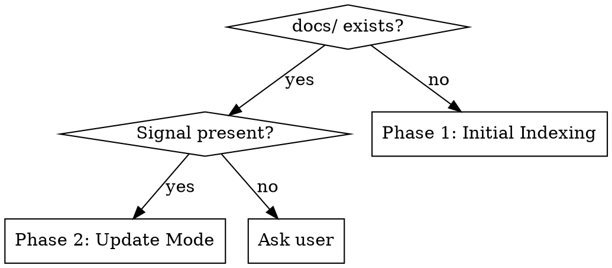

# Codebase Indexer

## Overview

Scan a project once, write five lean doc files to `docs/`, and read them every future session instead of re-scanning the whole codebase. After each feature or bugfix, update only what changed.

## When to Use / Mode Detection



**Signals that trigger Phase 2:** user says "update docs", "re-index", "update", or just finished describing a feature/bugfix.

**Ask user when ambiguous:** "Initial index found. Re-index from scratch, or update from recent changes?"

---

## Phase 1 — Initial Indexing

### Step 1: Detect Project Type

Check for project manifests (use Glob/Read):
- `package.json` → Node.js / JavaScript / TypeScript
- `pom.xml` → Maven / Java
- `build.gradle` / `build.gradle.kts` → Gradle / Java / Kotlin
- `go.mod` → Go
- `requirements.txt` / `pyproject.toml` / `setup.py` → Python
- `Cargo.toml` → Rust
- `*.csproj` / `*.sln` → .NET / C#
- `composer.json` → PHP

Multiple manifests = polyglot/monorepo — note all detected stacks.

### Step 2: Scan the Codebase

Use **Glob** and **Grep** (not Bash find/ls) for:

| What to find | How |
|---|---|
| Directory structure (≤3 levels) | `Glob **/*` then collapse paths |
| Entry points | `Grep` for `main`, `app`, `index`, `server`, `Application` |
| Key abstractions | `Grep` for `class`, `interface`, `export`, `func`, `def` |
| Config files | `Glob` for `*.env*`, `*.config.*`, `application.yml`, `application.properties` |
| External deps | Read manifest + lockfile (`package-lock.json`, `go.sum`, `pom.xml` deps) |
| Routing / API | `Grep` for `@GetMapping`, `router.get`, `app.get`, `path=` |

Limit scan depth: use `**/*.{ts,js,go,java,py,rs}` patterns — avoid node_modules, .git, build/, dist/, target/, __pycache__.

### Step 3: Generate Doc Files

Write all five files under `docs/` in the project root. Use the **Document Templates** section below as the fill-in structure. Do not invent information — if something cannot be determined from the scan, say so explicitly.

### Step 4: Update .gitignore

See **.gitignore Rules** section below.

### Step 5: Report

Tell the user:
- Which project type was detected
- Which files were created
- One sentence summary of what was found (e.g., "Spring Boot REST API with 4 service modules and PostgreSQL.")

---

## Phase 2 — Update Mode

### Step 1: Read Existing Docs

Use **Read** on each file in `docs/`. Understand what is already documented.

### Step 2: Identify What Changed

```bash
git diff HEAD~1 --name-only
```

Note which modules/packages were touched.

### Step 3: Re-Scan Affected Files

Use Glob + Grep on the changed files and their direct neighbors (same package/directory). Do not re-scan the whole project.

### Step 4: Update Relevant Doc Files

| Changed area | Update these files |
|---|---|
| New module or package | `architecture.md`, `implementation.md` |
| New class / function / endpoint | `implementation.md` |
| Renamed files or folders | `architecture.md`, `patterns.md` |
| New dependency added | `architecture.md` |
| New naming or code pattern | `patterns.md` |
| Architectural decision | `decisions.md` (see step 5) |

Apply targeted edits — do not rewrite unaffected sections.

### Step 5: Decisions Gate

Ask: **"Did this change involve making or reversing an architectural decision?"**

| Change | Update decisions.md? |
|---|---|
| Added new API endpoint | No |
| Switched REST → GraphQL | **Yes** |
| Fixed a null pointer bug | No |
| Replaced ORM after performance issues | **Yes** — e.g., "chose JOOQ over Hibernate due to N+1 problems" |
| Added a new service module | Only if the structural choice was deliberate |

If yes → append ADR entry to `decisions.md` using the ADR template.
If no → skip `decisions.md`.

### Step 6: Append Changelog Entry

Always append a new dated entry to `docs/changelog.md`:

```markdown
## YYYY-MM-DD — [brief description]
- What changed
- Which modules were affected
```

---

## Document Templates

### `docs/architecture.md`

```markdown
# Architecture

## Project Type
[Stack name, e.g., "Spring Boot 3 REST API (Java 21)"]

## Directory Map
[Top-level tree, ≤3 levels — omit build artifacts]

## Module Overview
| Module/Package | Purpose |
|---|---|
| `module-name` | One-line description |

## Data Flow
[Prose or simple diagram: how a request moves through the system]

## External Dependencies
| Name | Purpose |
|---|---|
| `library-name` | What it does |
```

### `docs/implementation.md`

```markdown
# Implementation

## Entry Points
[List main files / startup classes with one-line role each]

## Per-Module Breakdown

### [Module Name]
- **Entry point:** `path/to/file.ext`
- **Key classes/functions:** `ClassName`, `functionName(args)` — brief purpose
- **Initialization:** How this module starts up
- **Non-obvious logic:** Anything worth flagging for future sessions

## Configuration
| Variable / Property | Default | Purpose |
|---|---|---|
| `ENV_VAR` | `value` | What it controls |
```

### `docs/patterns.md`

```markdown
# Patterns

## Naming Conventions
- Files: [convention observed]
- Classes/types: [convention observed]
- Functions/methods: [convention observed]
- Variables: [convention observed]

## Folder Conventions
[Where things live and why — observed from scan]

## Recurring Code Patterns
- Error handling: [how errors are surfaced]
- Async: [callbacks / promises / async-await / goroutines / etc.]
- Dependency injection: [how DI works, if at all]
- Validation: [where input is validated]

## Testing Conventions
- Test file location: [e.g., `src/test/`, `__tests__/`, `*_test.go`]
- Test naming: [e.g., `should_doX_when_Y`]
- Test helpers: [shared fixtures, factories, etc.]

## Anti-Patterns Observed
[Only include if clearly present — e.g., "god classes in src/util/"]
```

### `docs/decisions.md`

```markdown
# Architectural Decisions

> ADR entries explain WHY — not what was built, but why it was built that way.

[No explicit decisions found — add entries here as you make choices.]

---

## [Decision Title]
**Date:** YYYY-MM-DD
**Why:** [Reason this approach was chosen]
**Tradeoffs:** [What was given up]
**Alternatives considered:** [What else was evaluated]
```

Populate from:
- `// ADR`, `// NOTE:`, `// DECISION:` comments in code
- Architectural README sections
- Obvious structural choices (e.g., monorepo, absence of ORM)

### `docs/changelog.md`

```markdown
# Changelog

## YYYY-MM-DD — Initial index
- First scan of codebase
- Generated architecture.md, implementation.md, patterns.md, decisions.md
```

---

## .gitignore Rules

1. Read `.gitignore` if it exists.
2. If `docs/` is already listed → do nothing.
3. If `.gitignore` exists but lacks `docs/` → append:
   ```

   # Generated by codebase-indexer
   docs/
   ```
4. If `.gitignore` does not exist → create it with:
   ```
   # Generated by codebase-indexer
   docs/
   ```

**Never duplicate** — always check before writing.

---

## Quick Reference

| Task | Action |
|---|---|
| First time on a project | Phase 1 (full scan, write all 5 files) |
| After feature/bugfix | Phase 2 (diff, targeted update, changelog entry) |
| Unsure which mode | Ask user |
| Reading docs next session | `Read docs/architecture.md` → `docs/implementation.md` → done |
| Adding an ADR | Append to `docs/decisions.md` using the ADR template |

---

## Common Mistakes

| Mistake | Fix |
|---|---|
| Re-scanning the full codebase in Update Mode | Use `git diff HEAD~1 --name-only` to scope the scan |
| Duplicating `.gitignore` entry | Always read first, append only if absent |
| Rewriting whole doc files on update | Edit only the sections corresponding to changed modules |
| Adding ADR for every change | Gate on "was this an architectural decision?" — most changes are not |
| Scanning `node_modules`, `target/`, `dist/` | Exclude build artifacts from all globs |
| Inventing details not found in scan | Say "not determinable from scan" rather than guessing |
